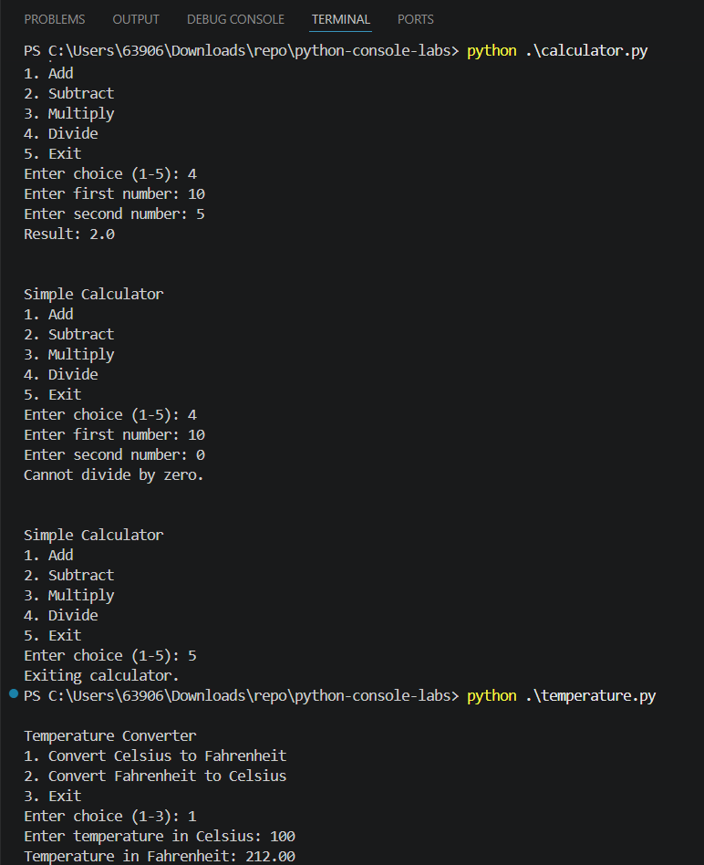
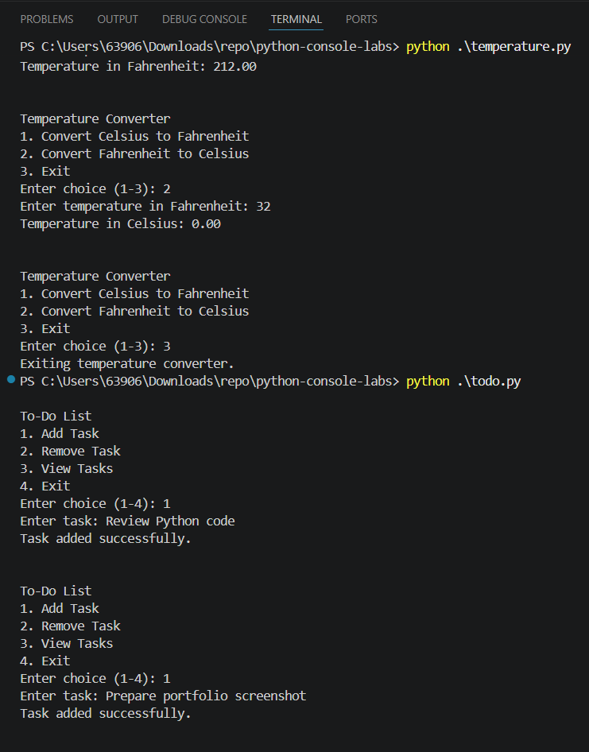
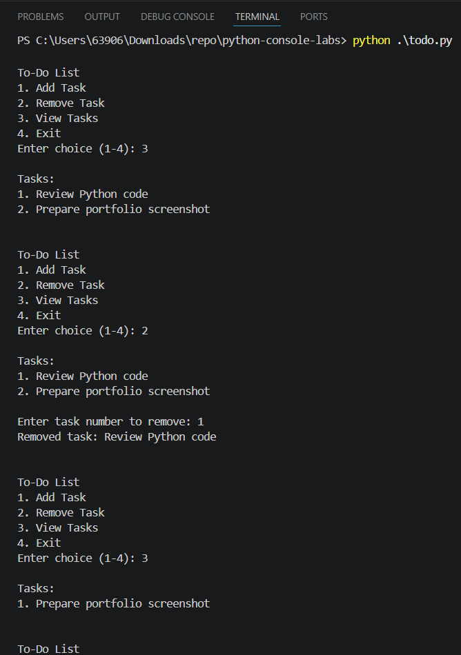
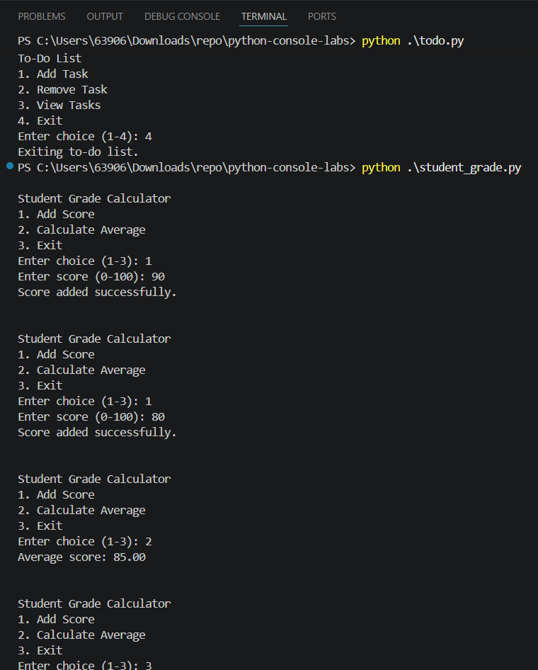
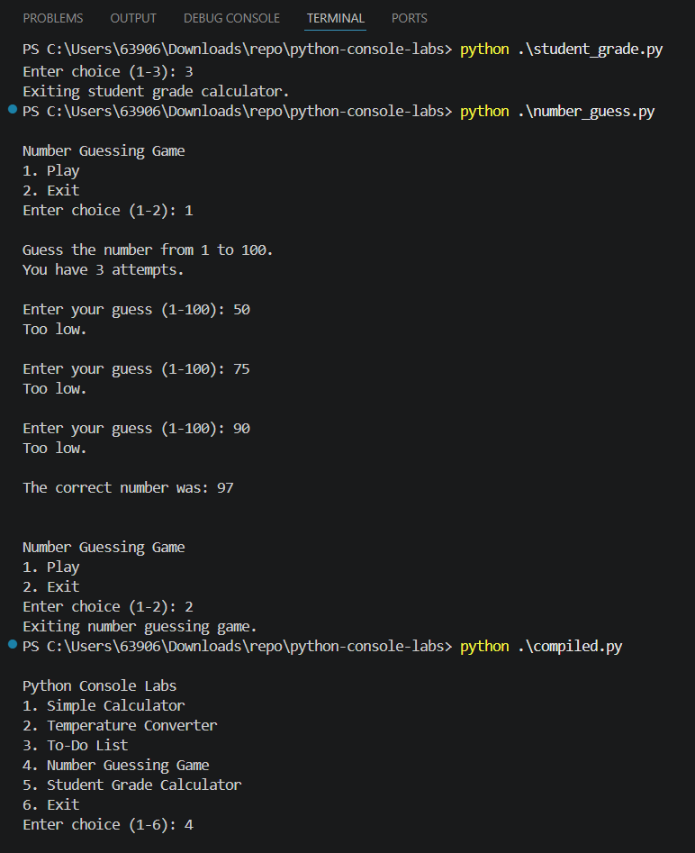
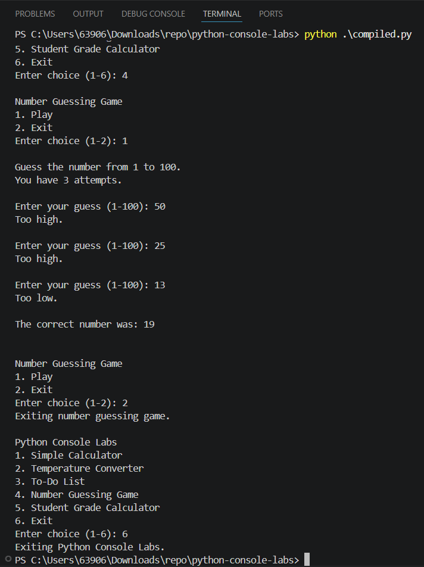

# Python Console Labs

A collection of Python console applications for practicing basic programming concepts, input validation, functions, loops, conditionals, and modular code organization.

This project includes multiple beginner-friendly programs such as a calculator, temperature converter, to-do list, number guessing game, and student grade calculator. A main menu program is also included to run each application from one place.

## Features

- Perform basic calculator operations
- Convert temperatures between Celsius and Fahrenheit
- Add, view, and remove to-do list tasks
- Play a number guessing game
- Add student scores and calculate the average
- Run all programs from a single main menu
- Shared input validation helper
- Clean modular Python file structure

## Technologies Used

- Python
- Visual Studio Code
- PowerShell
- Git and GitHub

## Project Structure

```text
python-console-labs/
├── .gitignore
├── README.md
├── assets/
│   ├── sample-output.png
│   ├── sample-output2.png
│   ├── sample-output3.png
│   ├── sample-output4.png
│   ├── sample-output5.png
│   └── sample-output6.png
├── calculator.py
├── compiled.py
├── input_utils.py
├── number_guess.py
├── student_grade.py
├── temperature.py
└── todo.py
```

## How to Run

### Windows PowerShell

1. Clone the repository:

```powershell
git clone https://github.com/TimNieto/python-console-labs.git
```

2. Go to the project folder:

```powershell
cd python-console-labs
```

3. Run the main program menu:

```powershell
python .\compiled.py
```

4. You can also run each program individually:

```powershell
python .\calculator.py
python .\temperature.py
python .\todo.py
python .\number_guess.py
python .\student_grade.py
```

### macOS/Linux

1. Clone the repository:

```bash
git clone https://github.com/TimNieto/python-console-labs.git
```

2. Go to the project folder:

```bash
cd python-console-labs
```

3. Run the main program menu:

```bash
python3 compiled.py
```

4. You can also run each program individually:

```bash
python3 calculator.py
python3 temperature.py
python3 todo.py
python3 number_guess.py
python3 student_grade.py
```

## Sample Output

### Calculator and Temperature Converter



### Temperature Converter and To-Do List



### To-Do List Task Removal



### Student Grade Calculator



### Number Guessing Game



### Main Menu and Number Guessing Game



## Database Notes

This project does not use a database.

All program data is stored temporarily while the program is running. Data such as tasks, scores, and game values are reset when the program exits.

## Programming Concepts Used

- Functions
- Loops
- Conditional statements
- Lists
- Input validation
- Modular programming
- Error handling
- Random number generation
- Basic arithmetic operations

## Future Improvements

- Add file saving for the to-do list
- Add more calculator operations
- Add difficulty levels for the number guessing game
- Add score history for the student grade calculator
- Add unit tests
- Improve the main menu interface

## License

This project is for educational and portfolio purposes only. All rights are reserved.

You may view the source code, but you may not copy, modify, distribute, or use this code without permission from the author.

## Author

Created by Tim Nieto.